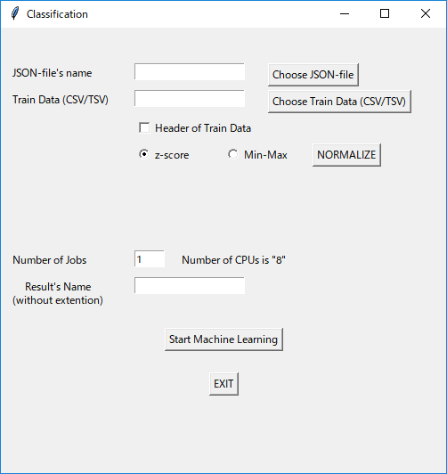

# classification.py

## GridSearchによる機械学習のチューニングとK-fold CVによる精度検証

### 使い方

1. `classification.py`を実行すると，以下のような画面が出てくる
2. **Choose JSON-file**，**Choose Train Data (CSV/TSV)**をそれぞれ選択する
	- 詳細は下記
3. **Number of Jobs**を決める（defaultは1）
	- 横に使用しているPCの最大スレッド数が出てるので，それ以上にならないようにする
4. **Result's Name**に結果を出力するディレクトリの名前を入力する
	- ディレクトリはclassification.pyと同じディレクトリに作成される
5. **Start Machine Learning**を押して，jsonファイルに記入されたパラメータでグリッドサーチとK-fold CVを実行する
	- logはターミナル/コマンドプロンプトに生成される

### jsonファイルの書式

サンプルデータが**JSON**ディレクトリに入っているので，それを参考にしてパラメータを設定する

#### method

- 機械学習の手法を指定する
- 現在，以下のものに対応している
	- SVM: support vector machine
	- KNN: K-nearest neighbor algorithm
	- Kmeans: k-means clustering
	- GMM: gaussian mixture model
	- RF: random forest

#### evaluation

現在，**CV**のみ対応（削除予定）

#### K

- K-fold CVの回数を指定する
- 現在，以下のものに対応している
	- auto: 学習用データの数に応じて自動で決定する
	- 整数値

#### param

例えば，`knn.json`なら以下のようになっているが，これは，

- *n_neighbors*は1から15
- *weights*は*uniform*と*distance*
- *leaf_size*は10, 20, 30, 40, 50

をそれぞれグリッドサーチで検証する，ということ

入力がなければデフォルト値で，`"weights":			["uniform"]`のようにすれば，そのパラメータで確定させる，となる

	"param":		[{
						"n_neighbors":		[1, 2, 3, 4, 5, 6, 7, 8, 9, 10, 11, 12, 13, 14, 15],
						"weights":			["uniform", "distance"],
						"leaf_size":		[10, 20, 30, 40, 50]
					}]

### 学習用データ（Train Data）の書式

- 原則として，`iris.csv`に準拠する
	- csv，もしくはtsv形式のみ読み込み可能
	- 縦方向に各サンプル，横方向に次元
	- 一番右側の列は教師ラベル
	- 例：irisなら縦150行，横5列
- 1行目がHeaderの時は，**Header of Train Data**にチェックを入れる

### 学習用データの正規化
- **Choose Train Data**で読み込んだ学習用データを正規化する: **NORMALIZE**で実行する
	- **z-score**：平均が1，標準偏差が1になるように正規化（default）
	- **Min-Max**: 最小値が0，最大値が1になるように正規化
- 全て，各次元（列）内で計算する
- 正規化後は，
	- 学習用データの末尾に「_norm」が追加されたデータが，元の学習用データと同じディレクトリに生成される
		- `iris.csv`なら`iris_norm.csv`
	- 自動的に学習用データの参照を正規化後のデータに差し替える
